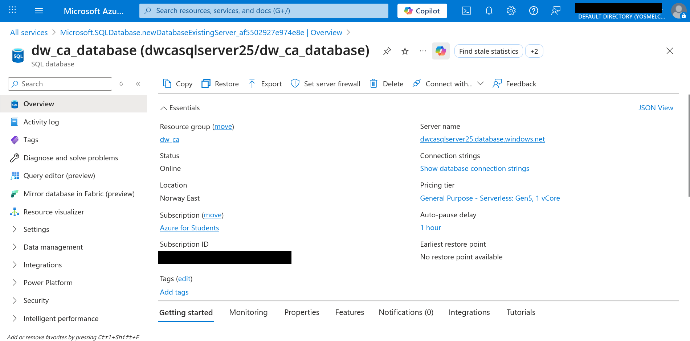

# Creating Azure SQL Server and Database
When creating a database, we first need a server. When working locally, we usually install the server and this is initiated and runs in the background. Then when we use a Database Management System, such as MySQL workbench for MySQL, we connect to this server using localhost with a preconfigured root user.

The logic is the same here, but the server is created, configured and runs on the cloud. The database is also created and linked to the same server.

## Azure SQL server
1. The first step is to create an Azure SQL server, we do this by navigating to the **Azure SQL Database** service `Services > Databases Azure SQL Database`.
2. Here we got a few ooptions on the left side nav bar. We want to choose the `Azure SQL Database > SQL Logical servers`.
3. We create one and configure:
    - basics:
        - the resource group: `dw_ca`
        - the server name: `dwcasqlserver25`
        - the location `Norway East`
        - the authentication: `both sql and microsoft entra`
            - for entra, just set yourself as admin
        - the server admin login: `server-admin`
        - the server admin password: `secretP@ssword`
    - networking:
        - allow azure services and resources to access: `yes`
    - review + create

## Azure SQL Database
1. We can skip the resource and server part as we already created those, we just select them and give the database a name
    - details:
        - database nane: `dw_ca_database`
        - workload environment: `development`
        - backgrup storage redundancy: `local`
    - networking
        - add current ip adress: `yes`
    - review + create

## SQL Table
We are going to need a table for the data that is going to be loaded into the database.

Once the database is created, query the database with the [CREATE TABLE query](table.sql) in this folder.

# Screenshot
