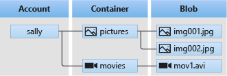

# Data Lake
When we refer to a Data Lake, we dont refer to a service by itself, instead its a set of capabilities dedicated to big data analytics and is built on top of `Azure Blob Storage` as a configuration.

When creating a storage account, we get the option to use a `Data Lake` as the technology for it.

## Data lake vs Blob Storage
If we just simply want to store data that is stored for non-analytical purposes, like images or media a simple `Azure Blob Storage` account will do. However, If we plan on doing analytical processing on our data, such as with spreadsheets, CSV files and such, we need to enable `Azure Data Lake Gen2` on the storage account during creation. 

## What is a data lake?
When explaining what a data lake is, we can simply call it a centralized repository where data does not have to fit a certain structure. Data can be either structures or unstructured and easily stored, accessed or analyzed in its raw / native format.

Read more here: https://learn.microsoft.com/en-us/azure/storage/blobs/data-lake-storage-introduction

We can also use these learning materials to explore more on Azure Data Lake Storage Gen2: https://learn.microsoft.com/en-us/training/modules/introduction-to-azure-data-lake-storage/

# Azure Blob Storage
Consists of 3 resources:

- The storage account
- A container in the storage account
- A blob in a container

# Storage Account
A storage acount is simply Blob storage (binary large objects) in the cloud where we can store files.

To read more on azure's use of blob storage click here https://learn.microsoft.com/en-us/azure/storage/blobs/storage-blobs-introduction

Microsoft Azure allows us to store upto 500TB of data in the cloud.

## Containers
A container is simply a way to organize blobs, its like a directory when we think about filesystems.

A storage account can include an unlimited amount of containers.

## How to move data into a container
- `azcopy` - A command line tool that can be used on linux to copy data to and from blob storages.
- `Azure Data Factory` - We can use ADF's linked services to do this, read more [here](https://learn.microsoft.com/en-us/azure/data-factory/connector-azure-blob-storage?toc=%2Fazure%2Fstorage%2Fblobs%2Ftoc.json&tabs=data-factory).
- `Azure Portal` - We simply navigate to the container and click on the upload button to upload files.

## Steps
We will upload our dataset files in a container, then create a linked service in Data Factory so we can extract and load this data into the database we created earlier after some adjustments.

1. The first step is to create a storage account where we can store our CSV dataset files
2. We navigate to the Azure services and find storage account `Storage > Storage accounts` 
3. The configuration is pretty straight forward:
    - basics
        - resource group is the same as we used for the database server.
        - we give it a name: `dwcastorage`
        - region will be: `Norway East`
        - preferred storage type: `Data Lake Storage Gen 2`
        - redundancy: `local`
    - data protection
        - disable all soft deletes: this is so that if we accidentally remove something, it will be lost, in this case we dont want files lingering around because thatll cost us storage.

    - review and create

## Container
Now with a storage acccount created, we can proceed to upload files to it.

Under data storage we got a few options.

The one we want to use is `containers`, its just a simple container that will hold our files. Later on we can access this storage account and the files inside the container.

1. Create a new container and give it a name `dwcacontainer25`.
2. Select the newly created container and upload the dataset files to it.