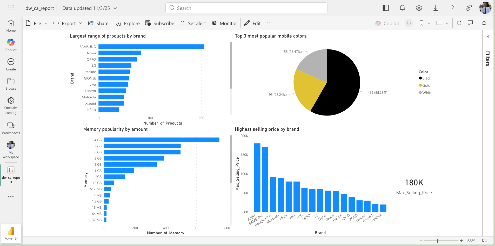
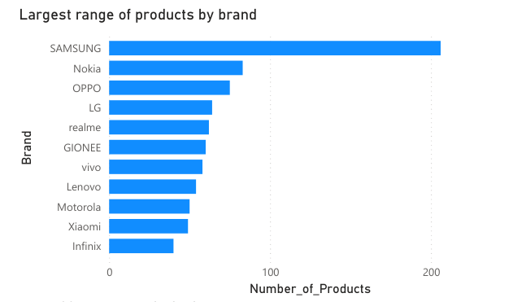
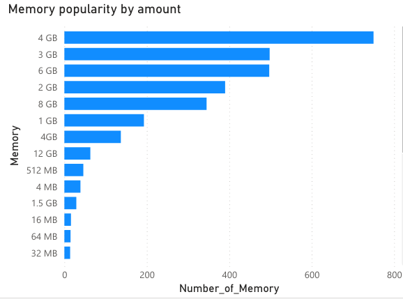
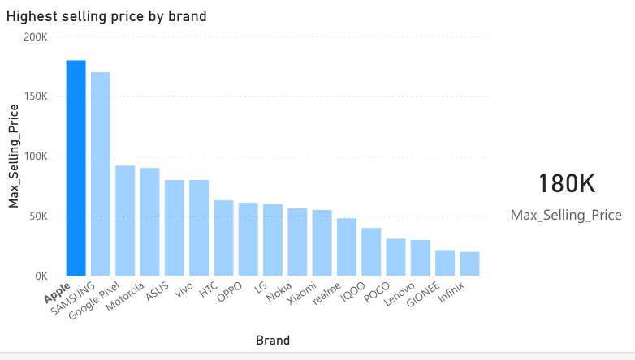
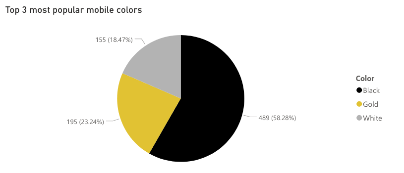

# About
Power BI is a tool we are going to use to connect to our SQL Database, transform the data and then create some reports.

The transformations we are going to perform the following
- Set the `Rating` column to `Decimal Number`.
- Set the `Selling Price` and `Original Price` to `Whole numbers`.
- Replace `Null Values` on the `Storage` column with `No information`.

Once this is done we are going to simply create a few measures:
- `Number_of_products = DISTINCTCOUNT(MobilePhoneModels[Model])` - Returns the row count for unique mobile models.
- `Number_of_memory = COUNT(MobilePhoneModels[Memory])` - Returns the row count for memories.
- `Max_selling_price = MAX(MobilePhoneModels[Selling Price])` - Returns the max amount of Selling Price for mobile phones.
- `Count_Colors = COUNT(MobilePhoneModels[Colors])` - Returns the row count of colors.

# Final result

# Answers
The chart above now allows us to nwer the following questions:
1.  Which mobile phone brand has the largest range of products?
    - Samsung has the largest range of products.
    - 
2.  What is the most popular amount of Memory for mobile phones?
    - 4GB is the most popular amount of memory.
    - 
3.  What brand has the most expensive selling price of any mobile phone?
    - Apple, with its most expensive phone having a selling price of 180k.
    - 
4.  Which colors are used most often by mobile phone brands?
    - The top 3 most popular colors are Black, Gold and White.
    - 