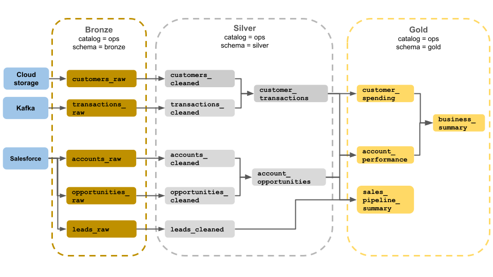
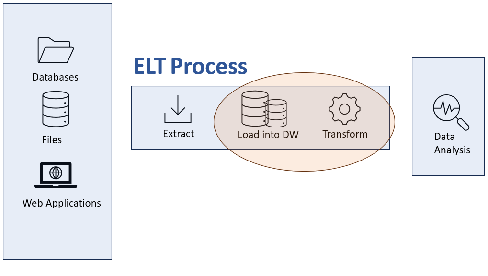

# Project
In this project we are going to build a data warehouse architecture using `Microsoft Azure` services.

We have two `CSV` files which which can be found under the folder **[datasets](datasets)**. We want to extract this data, do some adjustments to it so its managable for analytical purposes, then load into our data warehouse. Finally we want to create reports and charts using `Power BI` to be able to answer the following business questions:

- Which mobile phone brand has the largest range of products?
- What is the most popular amount of Memory for mobile phones?
- What brand has the most expensive selling price of any mobile phone?
- Which colors are used most often by mobile phone brands?

## Services used

| Layer | Azure Service | Purpose |
|-------|---------------|---------|
| Raw Storage | Azure Data Lake Storage Gen2 (ADLS Gen2) | A service to store our CSV files on the cloud |
| Orchestration & ETL | Azure Data Factory (ADF) | Data Lake + SQL Linked services along with Pipeline engine with a ETL Data flow |
| Analytical Storage | Azure SQL Database | Database storage for the joined dataset |
| Transformation & BI | Power BI | Final transformation and visualisation |

## File structure and steps

- [datasets](datasets) - Contain the CSV files used for this project.
- [0.Azure-SQL-Server-and-SQL-Databse](0.Azure-SQL-Server-and-SQL-Database) - Contain the steps required for creating a `SQL database`.
- [1.Storage-Account-and-Container](1.Storage-Account-and-Container)

# About data warehouses
Compared to traditional databases, a data warehouse is more of a concept / system and not a technology.

To quote Bill Inmon:
> A data warehouse is a subject-oriented, integrated, time-variant and non-volatile collection of data that supports management's decision makig process.

Lets dive into these concepts:
- `Subject-Oriented` - A data warehouse must be focused on data that is relevant to specific topics, like marketing or sales.
- `Integrated` - A data warehouse must be be able to retrieve data from multiple sources, like spreadsheets or operational databases.
- `Time-variant` - A data warehouse must be able to store historical data that can easily be accessed at any time.
- `Non-volatile` - A data warehouse keeps the data persistant and permanent, regardless of what new data is entered.

## Main components
The key components of a data warehouse architecture consist of:
- `Source` - Can be a relational database or a data lake.
- `ETL/ELT tools` - Tools that allow us to extract from sources, transform the date or load it directory to the data warehouse
- `Central database` - A core repository where data is stored.
- `Access tools`  - Software that can be used for presentational / reporting purposes and analytical decision-making.

## Architecture models
### Single-tier
Consists of three layers, `Source`, `Data warehouse` and `Analysis Layer`
- `Source` - The sources where data originates from, often these are relational databsaes, operational systems or spreadsheets
- `Data warehouse` - This is not a real database, its a virtual layer where data is organized in multidimensional view of the data.
- `Analysis Layer` - Allows the possibility to transform data fro source to a model for processing.

### Two-tier
Consists of four layers, `Source`, `Data Staging`, `Data Warehouse`, `Analysis`.
- `Source` - This stage is the same as single-tier 
- `Data Staging` - In this stage, compared to single-tier, we clean the data and transform it according to business requirements before its loaded into the data warehouse.
- `Data Warehouse` - Data is loaded into the data warehouse.
- `Analysis` - Clients can generate insights on the data stored in the data warehouse.

### Three-tier
Like two-tier, but includes a reconsiled layer, that puts extra focus on data integrity, consistency and quality. In short, this extra layer makes sure there are no problems with the data before its entered into the data wareshouse.

### Modern cloud architecture
This is the architecture we are using for this example. In short it leverages `Data lakes`, where data is available in its raw form (CSV in this case), according to architecture terms this is the **Bronze** phase. Data is then extracted using `ETL/ELT` tools, in this case `Azure Data Factory` to clean, transform and validate the data (**Silved** phase). Finally the data is loaded into a `Microsoft SQL database` where we can connect up with `Access tools`, in this case `Power BI` for analytical presentation. From with `Power BI`, we can further `enrich` the data for presentation purposes, such as handling null values and so on, this is according to architectural terms called the **gold** phase.

This architecture is called Medallion Architecture, we can read more up on it here: https://learn.microsoft.com/en-us/azure/databricks/lakehouse/medallion and here: https://www.databricks.com/glossary/medallion-architecture.

## Data lake
A data lake is simply a storage or a resposity that store data in its raw form, including structured or unstructured data.

This is perfect for dumping files as is, extracting them into a `ETL/ELT` tool such as `Azure Data Factory` and then sinking that data into a data warehouse.

Data lakes are extremely flexible, meaning they can be used for many cases, such as machine learning, AI or simply analytics. We dont need a defined data model for a data lake.

Data warehouses on the other hand work best with processed, structured data, they are not as flexible and their use case is often for analytical purposes and decision-making. 

## Data Integration
Data integration is the process by which data collected from multiple sources is combined and managed. 

The most common techniques used in data integration are:
- `ETL` - Data extracted, transformed and then loaed into the data warehouse.
- `ELT` - Data is extracted, loaed into the warehouse then transformation are made.
- Change data capture - Real-time identificaiton of changes made to data and immediately applying those changes in the data warehouse.
- `Data replication` - Data is simply duplicated.
- `Data virtualisation` - Data is not stored, rather it is virtually combined from multiple sources into a single view to avoid having to load it into the data warehouse.
- `Streaming data` - Data is simply streamed as is, and made available for analysis.

The one we are using in this example is `ELT`. We are extracting data from the `Data Lake`, doing a simple `join` inside `Azure Data Factory` and the loading it into the `SQL database`. The real transformation happens in `Power BI`, where we replace null values and change the column types to correct format.

Although we are doing some minor transformation in `Azure Data Factory`, such as joining data and setting the type for the columns. There is still null values in the data warehouse. These are handled in `Power BI`.

There are some benefits to ELT vs ETL, for examle, when favoring ELT, we dont need to wait for the data to be transformed before it is available to us with `Access Tools` like `Power BI`. Often the data is transformed, "just-enough" for us to work with it in the data warehouse and then we can further enrich it.